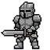

# JOB仕様書

## 目次
1. 概要説明  
2. 能力値の説明  
3. 各ジョブ一覧  
4. 相性補正一覧

---

## 1．概要説明
この文書はゲーム内の「ジョブ（ユニットの種類）」のデータをまとめたものです。  
重要：各ユニットは「スキル」を持ち、スキルは1ユニットにつき試合中に1回だけ使えます。スキルは強いので、使うタイミングが勝敗に大きく影響します。

---

## 2．能力値の説明
ジョブは次の5つの能力で表されます。説明は簡単な言葉で書いています。

- HP：体力。0になると倒れます。  
- 攻撃：攻撃の強さ。数字が大きいほどダメージが大きくなります。  
- 防御：受けるダメージを減らします。数字が大きいほどダメージが小さくなります。  
- 速度：1ターンでどれだけ動けるか。ゲーム内では「速度 ÷ 10」で扱います。  
  例：速度 30 → 3.0 マス分動ける。速度 56 → 5.6 マス分動ける。  
- 射程：攻撃が届く距離。ゲーム内では「射程 ÷ 10」で扱います。  
  例：射程 54 → 5.4 マス先まで攻撃できます。

注：速度と射程は10で割った小数をそのまま使います。端数も移動や攻撃の判定に意味があります。

---

## 3．各ジョブ一覧
アイコン画像は ../src/assets/images/jobs/ 内の対応ファイルを参照してください。表の能力値は順に HP / 攻撃 / 防御 / 速度 / 射程 です。スキルはすべて「1試合に1回」使えます。

| ジョブ名 | Jobキー | アイコン | HP | 攻撃 | 防御 | 速度 | 射程 | スキル（説明） |
| --- | ---: | :---: | ---: | ---: | ---: | ---: | ---: | --- |
| ソルジャー | soldier |  | 28 | 48 | 32 | 12 | 20 | ブレイブチャージ：３ターンの間、攻撃力が１．５倍になる。 |
| ランサー | lancer |  | 22 | 28 | 22 | 30 | 38 | リーチブレイク：範囲10タイルに貫通攻撃。 |
| アーチャー | archer |  | 18 | 18 | 20 | 30 | 54 | マルチショット：射程内の敵に、それぞれ70%威力の攻撃 |
| メイジ | mage |  | 26 | 32 | 24 | 28 | 30 | エレメンタルバースト：半径2マスに数ターンの継続ダメージを与える。 |
| ヒーラー | healer |  | 18 | 18 | 26 | 40 | 38 | メディカ：味方全体を回復し、回復効果を追加する。 |
| ガーディアン | guardian |  | 36 | 14 | 54 | 8 | 28 | フォートレス：4ターンの間、防御力が高くなる。味方を引きつける効果がある。 |
| アサシン | assassin |  | 18 | 40 | 14 | 36 | 32 | シャドウステップ：瞬時に移動して背後から大ダメージを与える。 |
| エンジニア | engineer |  | 20 | 16 | 30 | 30 | 44 | タレット展開：攻撃する砲台を設置して敵を攻撃させる。 |
| サモナー | summoner |  | 26 | 24 | 22 | 26 | 42 | チャンピオンコール：強力なチャンピオン（HP100攻撃力40）を召喚して5ターン一緒に戦わせる。 |
| スカウト | scout |  | 14 | 18 | 12 | 56 | 40 | リコンパルス：2ターンの間ステルスになり、敵から狙われずに移動できる。 |
| 相撲レスラー | sumo |  | 56 | 30 | 30 | 8 | 16 | 土俵轟砕：半径2タイルにダメージを与え、4タイル分敵を押し戻す効果がある。 |

---

## 4．相性補正一覧
- 有利：攻撃したときの与ダメージが ×1.2（20%増）になります。  
- 不利：相手から受けるダメージが ×1.5（50%増）になります。

下表は「攻撃する側」から見た有利／不利です。

| ジョブ | 有利（与ダメ×1.2） | 不利（被ダメ×1.5） |
| --- | ---: | --- |
| ソルジャー | アサシン | ランサー |
| ランサー | ガーディアン | アサシン |
| アーチャー | サモナー | スカウト |
| メイジ | ガーディアン | アーチャー |
| ヒーラー | メイジ | アサシン |
| ガーディアン | ソルジャー | メイジ |
| アサシン | ランサー | ガーディアン |
| エンジニア | スカウト | サモナー |
| サモナー | エンジニア | アーチャー |
| スカウト | アーチャー | エンジニア |
| 相撲レスラー | アサシン | メイジ |

補足：ヒーラーは攻撃用ではありませんが、メイジへの相性が有利として設定されています。

---

